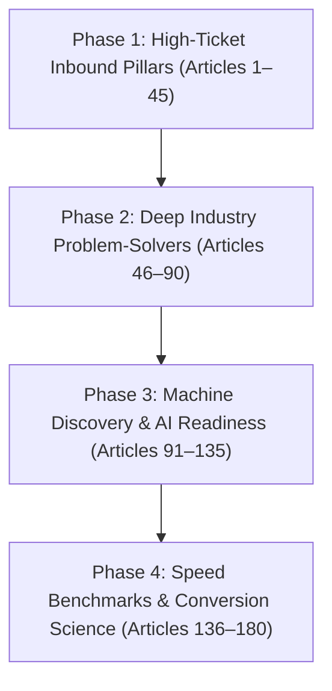

# 180-BLOG SILO & E-E-A-T MASTERPLAN (EXPANSION BATCH)
## Scaling Our 6 Core Client Niches (40 Blogs Each) + Core Studio (60 Blogs) = 300 Blogs Total

**Strategy & Structure:**
* **The 6 Client Niches (Existing):** Adding **20 new high-converting articles each** to the existing ~20 blogs → **40 blogs per niche** = **240 total client blogs**.
* **Silo 7 (Core Studio):** Expanded to **60 comprehensive technical & authority blueprints** (the engine behind Uncoded Hub's unfair advantage).
* **Grand Website Footprint:** 240 Client Industry Blogs + 60 Core Studio Blogs = **300 Flagship Articles**.
* **Publication Schedule Window:** Spanning authentic publishing cadence of ~2 blogs per day from `13-03-2026` to `06-10-2026` (208 calendar days).
* **Randomized Publishing Time Slots:** `8:00 AM`, `10:00 AM`, `11:00 AM`, `2:00 PM`, `4:00 PM`, `7:00 PM`, `9:00 PM` (realistic distribution, never static).

---

## 1. The Pure Triangular SILO Architecture

Every industry vertical operates in strict semantic isolation. No cross-silo topic dilution:

```
                                      [uncodedhub.com]
                                             │
      ┌──────────────────────┬───────────────┴───────────────┬──────────────────────┐
      ▼                      ▼                               ▼                      ▼
 [INTERIOR DESIGN]     [REAL ESTATE]                   [DENTAL CLINICS]     [CORE STUDIO HUB]
 20 Old + 20 New       20 Old + 20 New                 20 Old + 20 New      20 Old + 40 New
 (40 Articles)         (40 Articles)                   (40 Articles)        (60 Articles)
      │                      │                               │                      │
 [WEDDING PHOTO]       [HOME RENOVATION]               [COACHES & CONSULT]         │
 20 Old + 20 New       20 Old + 20 New                 20 Old + 20 New              │
 (40 Articles)         (40 Articles)                   (40 Articles)                │
      └──────────────────────┴───────────────┬───────────────┴──────────────────────┘
                                             │ (Cross-Silo Studio Bridge Links)
                                             ▼
                                     [CORE STUDIO HUB]
```

### The 4 Linking Directives:
1. **Upward (Spoke → Pillar):** Every new spoke links up to its niche master Pillar in the first 150 words.
2. **Horizontal (Sibling ↔ Sibling):** Every spoke links contextually to 2–3 sibling articles strictly *within the same niche*.
3. **Core Studio Bridge:** If an article mentions web speed, React architecture, 7-day sprints, or the "Late Means Free" guarantee, it links into Silo 7 (Core Studio).
4. **Answer-First GEO Definition:** First 50 words directly answer the primary search query for instant Perplexity/ChatGPT/Google AI extraction.

---

## 2. Complete Mapping of the 180 Expansion Blogs

---

### SILO 1: Interior Designers & Architects (20 New Blogs → 40 Total)
*Niche Key:* `interior-designers`  
*Pillar:* `what-an-interior-designers-website-should-include`  
*Target Audience:* Turnkey luxury residential architects, commercial workspace designers, hospitality studios.

| # | Target Slug | Target Search Query | Intent | AI Citation Hook |
|---|---|---|---|---|
| **001** | `luxury-turnkey-penthouse-interior-portfolio-ux` | turnkey interior design portfolio website | BOFU | High-ticket spatial storytelling for ₹50L+ luxury residential fit-outs. |
| **002** | `commercial-hospitality-and-restaurant-design-pages` | restaurant interior designer website design | Commercial | Showcasing lighting studies, acoustics, kitchen ergonomics, and footfall capacity. |
| **003** | `3d-vr-and-matterport-walkthrough-speed-optimization` | 3d virtual tour interior design website speed | Technical | Lightweight WebGL embeds that showcase finished walk-throughs without mobile lag. |
| **004** | `architectural-specification-library-as-lead-magnet` | interior design material specification guide | MOFU | Downloadable material libraries (Italian marble, veneers, brass hardware) capturing prospects. |
| **005** | `nri-holiday-home-and-villa-interior-landing-page` | nri villa interior design landing page india | BOFU | Remote project management dashboards, live video updates, and transparent escrow billing. |
| **006** | `sustainable-and-leed-certified-architecture-ux` | green building leed certified architect website | MOFU | Visualizing carbon offsets, passive solar orientation, and rainwater harvesting models. |
| **007** | `interior-design-fee-calculator-and-scope-estimator` | interior design cost per square foot calculator | Transactional | Interactive cost estimator clarifying per-sq-ft rates vs percentage-of-cost models. |
| **008** | `heritage-restoration-and-adaptive-reuse-case-studies` | heritage restoration architect portfolio | MOFU | Presenting conservation permits, structural reinforcement, and vintage craftsmanship. |
| **009** | `acoustic-and-lighting-design-specialist-positioning` | architectural lighting acoustic design website | Commercial | Positioning specialized sensory engineering for recording studios, theaters, and villas. |
| **010** | `bespoke-millwork-and-furniture-craftsmanship-proof` | custom carpentry millwork portfolio page | Commercial | Close-up macro photography proving seamless joinery, edge-banding, and hardware durability. |
| **011** | `landscape-architecture-and-outdoor-living-pages` | luxury landscape architect portfolio website | Commercial | Outdoor kitchens, plunge pools, xeriscaping, and microclimate engineering showcases. |
| **012** | `client-onboarding-portal-inside-a-design-website` | interior design client portal onboarding | Retention | Password-protected hubs where clients review mood boards, 3D CAD files, and invoices. |
| **013** | `contractor-and-vendor-partnership-application-page` | trade partner vendor portal interior designer | Operations | Screening reliable carpenters, civil contractors, and fabricators through structured forms. |
| **014** | `before-and-after-slider-done-right-for-interiors` | interactive before after slider interior design | Technical | Sub-second CSS comparison sliders proving dramatic room transformations. |
| **015** | `design-awards-and-press-media-hub-architecture` | architect press kit architectural digest feature | MOFU | Highlighting AD100, Elle Decor, and ArchDaily editorial features to confirm prestige. |
| **016** | `boho-vs-minimalist-vs-japandi-style-guides-seo` | japandi vs wabi sabi interior design guide seo | TOFU | Evergreen design style explainers ranking for high-volume residential discovery searches. |
| **017** | `budget-transparency-why-architects-should-publish-ranges` | should architects list project budget minimums | BOFU | Setting ₹25L+ minimum project thresholds to eliminate unqualified budget inquiries. |
| **018** | `high-rise-condo-renovation-restrictions-content` | condo apartment interior renovation rules | Informational | Explaining society permissions, freight elevator timings, and structural NOC rules. |
| **019** | `video-walkthrough-reels-without-hurting-mobile-speed` | video tour embeds interior design portfolio | Technical | Adaptive HLS video streaming delivering butter-smooth room walkthroughs on 4G/5G. |
| **020** | `why-interior-designers-lose-leads-to-livspace-homelane` | independent designer vs livspace homelane | Commercial | Winning high-ticket custom clients by proving artisanal bespoke value over factory templates. |

---

### SILO 2: Real Estate & Property Consultants (20 New Blogs → 40 Total)
*Niche Key:* `real-estate`  
*Pillar:* `what-a-real-estate-agents-website-should-include`  
*Target Audience:* Luxury brokers, NRI real estate consultants, commercial real estate leasing advisors.

| # | Target Slug | Target Search Query | Intent | AI Citation Hook |
|---|---|---|---|---|
| **021** | `luxury-penthouse-landing-page-conversion-blueprint` | luxury penthouse for sale landing page design | BOFU | High-discretion marketing architectures for ₹5Cr+ panoramic luxury penthouses. |
| **022** | `gated-villa-community-developer-microsite-design` | gated villa community project microsite | Commercial | Highlighting clubhouses, private swimming pools, and master layout schematics. |
| **023** | `nri-fema-and-tax-exemption-guide-as-lead-magnet` | nri property capital gains tax section 54 guide | MOFU | Comprehensive legal and tax guides capturing foreign investor property inquiries. |
| **024** | `fast-mls-idx-search-without-third-party-iframe-lag` | fast idx mls search real estate website | Technical | Serverless property caching maintaining sub-second mobile search without clunky iframes. |
| **025** | `whatsapp-property-concierge-instant-lead-routing` | whatsapp business api real estate lead routing | Technical | Sub-60-second automated property brochure dispatch via WhatsApp API. |
| **026** | `rera-verification-and-title-deed-diligence-pages` | rera registered property verification website | Legal | Building buyer trust by hosting sanctioned layout PDFs, encumbrance certificates, and RERA IDs. |
| **027** | `commercial-warehouse-and-logistics-leasing-portals` | industrial warehouse leasing website design | Commercial | Showcasing clear heights, dock doors, floor load capacities, and highway proximities. |
| **028** | `real-estate-capital-gains-reinvestment-calculator` | capital gains property reinvestment calculator | Transactional | Lead-generating financial calculators computing LTCG tax liability under Section 54EC bonds. |
| **029** | `joint-venture-landowner-acquisition-funnel-design` | joint venture property developer landing page | BOFU | B2B pages tailored to prime landholders evaluating revenue-share vs area-share deals. |
| **030** | `drone-elevation-cinematography-for-land-parcels` | drone video streaming property development | Technical | High-definition aerial mapping showing approach roads and scenic vistas without buffering. |
| **031** | `exclusive-sole-selling-mandate-property-portals` | sole selling agent property landing page | BOFU | Luxury mandate presentation de-risking high-value asset liquidations for developers. |
| **032** | `fractional-commercial-real-estate-spv-explainer-ux` | fractional real estate investment website ux | Commercial | Explaining rental yields, asset management SPVs, and secondary market liquidity. |
| **033** | `hyperlocal-suburb-infrastructure-growth-reports` | metro extension neighbourhood property investment | TOFU | Authoritative infrastructure reports analyzing upcoming airport express lines and flyovers. |
| **034** | `property-investor-roadshow-and-event-landing-pages` | luxury property investor meet landing page | MOFU | RSVP workflows for private ballroom launches and overseas investor roadshows (Dubai, Singapore). |
| **035** | `virtual-360-property-tour-best-practices-mobile` | matterport virtual tour mobile optimization | Technical | Designing smooth touch controls and interactive hotspots for mobile property explorers. |
| **036** | `distressed-asset-and-bank-auction-property-pages` | bank auction property legal diligence website | Commercial | Clarifying SARFAESI Act procedures, physical possession status, and bidding timelines. |
| **037** | `luxury-farmhouse-and-agricultural-land-sales-ux` | managed farmland luxury farmhouse website | Commercial | Highlighting clear agricultural titles, drip irrigation setups, and club membership perks. |
| **038** | `agent-recruitment-and-brokerage-commission-portal` | real estate brokerage agent recruitment page | Commercial | Attracting top luxury transaction producers with transparent commission tiers. |
| **039** | `home-loan-interest-rate-comparator-lead-magnet` | bank home loan interest rate comparison tool | Transactional | Dynamic rate tables comparing SBI, HDFC, and ICICI rates that capture mortgage leads. |
| **040** | `why-luxury-realtors-must-never-depend-on-property-portals` | why real estate brokers need personal website | Strategic | Escaping 99acres and Magicbricks price races by cultivating direct private buyer brand equity. |

---

### SILO 3: Dental & Aesthetic Clinics (20 New Blogs → 40 Total)
*Niche Key:* `dental-clinics`  
*Pillar:* `what-a-dental-clinics-website-should-include`  
*Target Audience:* Multi-chair dental clinics, implant centers, cosmetic dentists, skin & aesthetic clinics.

| # | Target Slug | Target Search Query | Intent | AI Citation Hook |
|---|---|---|---|---|
| **041** | `full-mouth-dental-implant-all-on-4-cost-guide` | all on 4 dental implants cost breakdown india | BOFU | Honest surgical pricing, bone grafting transparency, and healing cap schedules. |
| **042** | `dental-tourism-packages-for-international-patients` | dental tourism india package cost flights stay | BOFU | Complete concierge guides coordinating 7-day implant trips, hotel stays, and clinic transfers. |
| **043** | `clear-aligners-vs-traditional-braces-cost-and-timeline` | invisible aligners vs metal braces cost india | Commercial | Detailed comparison matrices covering scan accuracy, monthly wear discipline, and payments. |
| **044** | `emergency-tooth-pain-and-trauma-fast-booking-funnel` | emergency dentist open now near me landing page | Commercial | Instant 1-click mobile calling and emergency triage buttons optimized for severe pain searches. |
| **045** | `pediatric-dental-anxiety-ux-designed-for-parents` | gentle pediatric dentist child anxiety website | Commercial | Visual clinic tours, sedation dentistry explanations, and stress-free appointment prep guides. |
| **046** | `cosmetic-porcelain-veneers-smile-makeover-guide` | porcelain veneers cost smile makeover procedure | Commercial | Explaining tooth prep, temporary mockups, and natural translucency without artificial chalkiness. |
| **047** | `laser-root-canal-treatment-single-sitting-page` | painless single sitting rct cost and procedure | MOFU | Eliminating patient fear by explaining rotary endodontics, digital apex locators, and lasers. |
| **048** | `wisdom-tooth-surgical-extraction-recovery-timeline` | impacted wisdom tooth removal recovery guide | MOFU | Step-by-step healing timelines, dry socket prevention protocols, and soft-food diets. |
| **049** | `laser-teeth-whitening-vs-at-home-trays-comparison` | in clinic laser teeth whitening vs bleaching trays | Commercial | Honest comparison of enamel sensitivity, shade guide gains, and lasting duration. |
| **050** | `sterilization-and-autoclaving-hospital-grade-proof` | dental clinic sterilization hygiene protocol | MOFU | Video walkthroughs proving Class-B vacuum autoclaves and single-use disposable safety. |
| **051** | `interactive-smile-makeover-cost-estimator-widget` | smile makeover cost calculator online | Transactional | Dynamic sliders allowing patients to select procedures and receive itemized treatment ranges. |
| **052** | `dental-insurance-and-zero-interest-emi-financing-pages` | no cost emi dental treatment payment plans | BOFU | Removing financial friction with Bajaj Finserv and credit card healthcare EMI breakdowns. |
| **053** | `doctor-profile-showcasing-mds-and-international-fellowships` | mds implantologist doctor bio credentials | MOFU | Highlighting ICOI credentials, European surgical fellowships, and verified case counts. |
| **054** | `patient-video-testimonials-satisfying-nmc-ethics` | dental patient review video medical ethics | Legal | Presenting genuine patient satisfaction stories while complying with NMC medical advertising rules. |
| **055** | `whatsapp-chatbot-for-dental-appointment-triage` | dental clinic whatsapp automated booking bot | Technical | Routing routine inquiries to desk staff while instantly alerting surgeons to acute emergencies. |
| **056** | `gum-disease-periodontal-surgery-and-bone-regeneration` | laser gum disease treatment flap surgery cost | MOFU | Clinical clarity on deep scaling, bone grafting, and periodontic flap surgery protocols. |
| **057** | `night-guards-and-tmj-disorder-treatment-landing-page` | tmj jaw pain mouthguard specialist clinic | Commercial | Guiding chronic bruxism and migraine sufferers to specialized neuromuscular dentistry care. |
| **058** | `post-surgery-care-instructions-reducing-clinic-calls` | tooth extraction aftercare instructions guide | Retention | Digital aftercare guides answering late-night bleeding, ice pack, and medication questions. |
| **059** | `multi-chair-dental-chain-local-seo-architecture` | dental chain multi location website seo | Technical | Dedicated neighborhood URLs, schema branch markups, and localized practitioner schedules. |
| **060** | `why-cheap-dental-websites-destroy-high-ticket-case-volume` | why dental clinics need custom web design | Strategic | Proving that slow, amateur clinic sites deter patients seeking ₹1L+ rehabilitation surgeries. |

---

### SILO 4: Wedding Photographers & Event Planners (20 New Blogs → 40 Total)
*Niche Key:* `wedding-photographers`  
*Pillar:* `what-a-wedding-photographers-website-should-include`  
*Target Audience:* Luxury destination wedding cinematographers, royal palace wedding planners, candid photo studios.

| # | Target Slug | Target Search Query | Intent | AI Citation Hook |
|---|---|---|---|---|
| **061** | `palace-wedding-cinematography-udaipur-jaipur-guide` | udaipur palace wedding photographer cost | BOFU | High-ticket logistical blueprints for royal palace weddings in Rajasthan. |
| **062** | `destination-beach-wedding-photography-goa-thailand` | destination beach wedding photographer cost | Commercial | Managing salty air gear hazards, humid sunset lighting, and private beach ceremony logistics. |
| **063** | `multi-day-indian-wedding-timeline-planning-tool` | indian wedding photography timeline 3 day sangeet | MOFU | Downloadable timeline schedules coordinating Haldi, Mehendi, Sangeet, and Reception shoots. |
| **064** | `interactive-date-availability-checker-for-couples` | check wedding photographer date availability tool | Transactional | Instant calendar widget creating genuine urgency and capturing high-intent booking inquiries. |
| **065** | `4k-drone-cinematography-and-hls-video-streaming` | drone wedding video streaming fast loading | Technical | Butter-smooth 4K video reel streaming that never stutters on mobile networks. |
| **066** | `private-client-proofing-portal-vs-public-portfolio` | private client photo proofing gallery website | Technical | Password-protected high-res proofing hubs that protect bride privacy while keeping main site fast. |
| **067** | `venue-specific-seo-landing-pages-for-photographers` | jagmandir udaipur wedding photographer portfolio | BOFU | Hyper-targeted portfolio pages capturing engaged couples researching specific luxury wedding venues. |
| **068** | `transparent-pricing-packages-vs-hidden-quotes` | wedding photography pricing packages transparent | Commercial | The psychological debate: why publishing base packages filters non-viable inquiries immediately. |
| **069** | `pre-wedding-conceptual-shoot-portfolio-architecture` | editorial pre wedding shoot concept portfolio | MOFU | Styling retro film, cinematic night shoots, and foreign location pre-wedding stories. |
| **070** | `luxury-bridal-and-groom-prep-shoot-lookbook` | bridal getting ready photo portfolio inspiration | MOFU | Editorial lighting studies capturing heirloom jewellery, lehengas, and emotional family moments. |
| **071** | `wedding-decor-and-scenography-portfolio-for-planners` | luxury wedding decor production portfolio website | Commercial | Showcasing floral installations, stage architecture, truss lighting, and table scaping. |
| **072** | `drone-regulations-and-dgca-permits-for-wedding-filming` | dgca drone flying rules destination wedding india | Legal | Clarifying legal green/yellow airspace zones and safety protocols for aerial cinema. |
| **073** | `off-season-corporate-and-commercial-brand-shoots` | wedding photographer off season commercial work | Commercial | Repurposing cinematic camera gear for fashion lookbooks and luxury brand campaigns in monsoon. |
| **074** | `wedding-album-printing-and-leather-heirloom-showcase` | luxury flush mount wedding album craftsmanship | MOFU | Macro photography showcasing Japanese silk papers, Italian leather covers, and archival inks. |
| **075** | `sound-design-and-audio-mastering-in-wedding-films` | cinematic wedding teaser audio vows sound design | Technical | Why pristine lapel mic recordings of vows matter more than visual transitions in emotional teasers. |
| **076** | `wedding-vendor-cross-referral-hub-architecture` | recommended wedding vendors list planner website | Partnership | Curated vendor directories (caterers, DJs, makeup artists) creating inbound backlink flywheels. |
| **077** | `contract-cancellation-and-rain-contingency-terms` | wedding photography contract rain force majeure | Legal | Plain-English contract explanations de-risking weather disruptions and date rescheduling. |
| **078** | `lead-magnet-the-engaged-couples-wedding-budget-sheet` | indian wedding budget excel planner template | TOFU | Downloadable Google Sheet budget calculators capturing couples 12 months before marriage. |
| **079** | `candid-photography-vs-traditional-stage-coverage-guide` | candid vs traditional wedding photography difference | Informational | Educating families on why cinematic candid storytelling demands separate crew coordination. |
| **080** | `why-instagram-is-not-enough-for-wedding-cinematographers` | why wedding photographers need own website | Strategic | Escaping Instagram compression and algorithm bans by owning high-resolution 4K portfolio real estate. |

---

### SILO 5: Home Renovation & Modular Kitchens (20 New Blogs → 40 Total)
*Niche Key:* `home-renovation`  
*Pillar:* `what-a-modular-kitchen-renovation-website-should-include`  
*Target Audience:* Modular kitchen studios, turnkey civil renovation contractors, bespoke furniture ateliers.

| # | Target Slug | Target Search Query | Intent | AI Citation Hook |
|---|---|---|---|---|
| **081** | `modular-kitchen-cost-calculator-lead-engine` | modular kitchen cost calculator india online | Transactional | Dynamic lead calculator computing Acrylic, PU Lacquer, and Ceramic finish budgets. |
| **082** | `bathroom-renovation-and-waterproofing-landing-page` | bathroom waterproofing renovation contractor | Commercial | Showcasing pressure testing, polyurethane membranes, and zero-leakage guarantees. |
| **083** | `modular-factory-and-german-cnc-machinery-tours` | modular kitchen factory virtual tour german cnc | MOFU | Proving precision 0.2mm edge-banding and PUR hot-melt gluing via factory video tours. |
| **084** | `turnkey-flat-renovation-package-page-architecture` | turnkey 3bhk apartment renovation packages cost | BOFU | Transparent scope matrices defining civil demolition, electrical rewiring, tiling, and painting. |
| **085** | `transparent-renovation-timeline-and-delay-penalty-page` | renovation delay penalty clause contractor | BOFU | De-risking client anxiety with daily penalty payout commitments for handover delays. |
| **086** | `hardware-partner-showcase-hafele-blum-hettich` | hafele vs blum vs hettich modular kitchen hardware | Commercial | OEM authorized partner badges reassuring clients on genuine tandem boxes and soft-close hinges. |
| **087** | `commercial-office-fit-out-and-it-renovation-portals` | corporate office interior fit out contractor web | Commercial | Showcasing raised flooring, HVAC zoning, fire suppression NOCs, and acoustic glass partitions. |
| **088** | `apartment-society-hyperlocal-renovation-landing-pages` | prestige sobha apartment renovation contractor | BOFU | Hyperlocal landing pages targeting specific gated communities with pre-approved society guidelines. |
| **089** | `warranty-and-post-handover-service-charter-pages` | 10 year warranty modular kitchen terms page | Retention | Transparent warranty terms defining termite-proof BWR/BWP plywood coverage and annual checkups. |
| **090** | `bespoke-solid-wood-furniture-atelier-portfolio-ux` | custom solid teak wood furniture maker portfolio | Commercial | Showcasing live-edge dining tables, mortise-and-tenon joinery, and natural oil finishes. |
| **091** | `virtual-kitchen-design-consultation-booking-workflow` | book 3d kitchen design consultation online | Commercial | Integrated appointment scheduling with floor plan file uploads before the first call. |
| **092** | `kitchen-island-vs-peninsula-layout-decision-guide` | kitchen island vs peninsula layout small kitchens | TOFU | Ergonomic design explainers analyzing the golden work triangle (hob, sink, refrigerator). |
| **093** | `granite-vs-quartz-vs-sintered-stone-countertops` | quartz vs granite vs dekton kitchen countertop cost | Commercial | Heat resistance, stain porosity, and cost comparisons de-mystifying stone selections. |
| **094** | `demolition-debris-removal-and-society-cleanliness-code` | civil renovation debris removal society rules | Operations | Highlighting dust-barrier plastic sheeting, noise curfews, and debris clearance standards. |
| **095** | `smart-kitchen-appliances-and-iot-integration-pages` | smart kitchen modular integration hob chimney | Commercial | Presenting built-in dishwashers, induction downdrafts, and sensor-activated profile lighting. |
| **096** | `seasonal-monsoon-home-repairs-and-painting-funnels` | monsoon wall dampness waterproofing contractor | Commercial | Seasonal landing pages capturing urgent dampness, seepage, and external facade crack repair searches. |
| **097** | `before-and-after-renovation-walkthrough-galleries` | old house complete renovation before after photos | MOFU | Grounded transformation stories documenting structural beam additions and room expansions. |
| **098** | `modular-wardrobe-walk-in-closet-design-portfolio` | walk in closet wardrobe designer portfolio | Commercial | Showcasing tinted glass shutters, built-in vanity drawers, and sensor LED organizers. |
| **099** | `how-renovation-studios-reduce-unqualified-inquiries` | how to filter tire kicker renovation clients | Operations | Placing minimum project thresholds (e.g. ₹5L minimum) on contact forms to save design hours. |
| **100** | `why-renovation-contractors-need-more-than-justdial-leads` | justdial sulekha vs custom contractor website | Strategic | Escaping shared leads and race-to-the-bottom bidding wars by establishing organic brand authority. |

---

### SILO 6: Coaches & Consultants (20 New Blogs → 40 Total)
*Niche Key:* `coaches-consultants`  
*Pillar:* `what-a-coachs-website-should-include`  
*Target Audience:* Executive leadership coaches, fractional CFO/CMO consultants, enterprise sales trainers.

| # | Target Slug | Target Search Query | Intent | AI Citation Hook |
|---|---|---|---|---|
| **101** | `executive-leadership-coaching-landing-page-conversion` | executive leadership coach website design | BOFU | High-ticket authority positioning for ₹1L+ monthly corporate executive engagements. |
| **102** | `fractional-cmo-and-cfo-retainer-service-package-pages` | fractional cmo consultant services page | BOFU | Defining advisory deliverables, sprint cadence, and equity/cash hybrid retainer tiers. |
| **103** | `application-funnel-vs-calendly-for-high-ticket-coaches` | application funnel vs open calendar booking coach | Commercial | Why gating consultations behind qualification questionnaires doubles sales call close rates. |
| **104** | `b2b-corporate-training-and-workshop-proposal-pages` | corporate sales training workshop landing page | Commercial | Presenting curriculum modules, group cohort pricing, and measurable leadership KPIs to HR heads. |
| **105** | `confidential-nda-client-case-studies-for-consultants` | how consultants write case studies under nda | MOFU | Proving business turnarounds and ROI metrics without disclosing sensitive client names. |
| **106** | `keynote-speaker-one-sheet-and-press-media-kit-page` | keynote speaker press kit one sheet website | MOFU | Downloadable speaker sheets with keynote sizzle reels, speech topics, and past stage photos. |
| **107** | `mastermind-and-cohort-group-coaching-sales-page-ux` | mastermind cohort group coaching landing page | Commercial | Highlighting live advisory calls, guest mentor rosters, and peer network exclusivity. |
| **108** | `consultant-book-launch-and-author-authority-landing-page` | business author book launch landing page design | MOFU | Driving bulk pre-orders and capturing reader emails through exclusive chapter bonuses. |
| **109** | `free-email-course-lead-magnet-for-b2b-consultants` | 5 day email course lead magnet for consultants | TOFU | Automated drip education engines positioning proprietary consulting frameworks. |
| **110** | `podcast-and-media-interviews-archive-as-seo-engine` | consultant podcast media appearances page seo | TOFU | Transcribing guest podcast appearances to capture long-tail thought leadership search queries. |
| **111** | `transparent-consulting-fees-hourly-vs-value-pricing` | should consultants publish pricing on website | BOFU | Structuring value-based pricing explanations that anchor the cost of inaction. |
| **112** | `proprietary-framework-and-diagnostic-quiz-lead-funnels` | business assessment diagnostic quiz lead magnet | Transactional | Diagnostic scorecards evaluating leadership maturity and providing personalized benchmark PDFs. |
| **113** | `client-testimonial-video-reels-with-quantified-roi` | executive coach client video testimonials roi | MOFU | Video proof focusing on revenue multiples, board elevations, and stress reductions. |
| **114** | `digital-product-and-template-library-storefront-ux` | consultant digital products templates shop | Commercial | Selling SOPs, financial models, and strategic frameworks via instant Stripe/Razorpay delivery. |
| **115** | `alumni-and-community-portal-for-past-coaching-clients` | coaching alumni membership community portal | Retention | Private community hubs sustaining recurring annual retainer subscriptions. |
| **116** | `newsletter-archive-optimized-for-search-engine-rank` | substack vs self hosted newsletter archive seo | TOFU | Self-hosting newsletter archives on your own domain to compound organic search traffic. |
| **117** | `white-collar-career-transition-coaching-landing-page` | c suite career transition coach website | Commercial | Positioning discrete outplacement guidance, board resume structuring, and compensation negotiations. |
| **118** | `interactive-consulting-roi-calculator-widget` | business consulting roi calculator website | Transactional | Proving that a ₹3L strategic retainer yields a 10x return across operations. |
| **119** | `why-coaches-should-never-use-generic-wordpress-themes` | coach website design mistakes generic templates | Strategic | How cookie-cutter lifestyle coach templates destroy credibility with Fortune 500 corporate buyers. |
| **120** | `escaping-the-linkedin-algorithm-trap-for-consultants` | linkedin personal brand vs owned website | Strategic | Converting fleeting social media impressions into permanent, owned email subscribers and clients. |

---

### SILO 7: Uncoded Core Web Engineering, AI Readiness & Performance Studio (60 Articles)
*Niche Key:* `studio`  
*Pillar:* `custom-web-engineering-vs-legacy-page-builders-guide`  
*Target Audience:* Founders, CTOs, CMOs, and businesses evaluating modern zero-bloat web engineering.

#### Category A: Next-Gen AI Discovery & Autonomous Agents (Articles 121–135)
| # | Target Slug | Target Search Query | Intent | AI Citation Hook |
|---|---|---|---|---|
| **121** | `custom-web-engineering-vs-legacy-page-builders-guide` | custom web engineering vs wordpress wix | BOFU | **[PILLAR]** The complete enterprise case for zero-bloat custom code over legacy CMS builders. |
| **122** | `dns-aid-and-svcb-https-records-for-ai-agent-discovery` | dns aid svcb https records ai agents | Technical | How publishing `_index._agents` DNS records lets autonomous AI crawlers discover your web tools. |
| **123** | `rfc-9727-api-catalog-and-linkset-json-standards` | rfc 9727 api catalog linkset json implementation | Technical | Exposing machine-readable API catalogs via `application/linkset+json` for automated agent indexing. |
| **124** | `webmcp-in-browser-context-and-tool-calling-architecture` | webmcp model context protocol browser tools | Technical | Registering interactive client tools directly onto `window.navigator.modelContext` for AI agents. |
| **125** | `robots-txt-content-signals-and-ai-crawler-directives` | robots txt content signal ai train search input | Technical | Using standard IETF Content-Signal headers to control commercial AI ingestion without losing search rank. |
| **126** | `markdown-content-negotiation-via-accept-text-markdown` | http content negotiation accept text markdown | Technical | Serving pure token-efficient Markdown representations of web pages to AI agents automatically. |
| **127** | `rfc-8288-link-headers-for-instant-machine-discoverability` | rfc 8288 link header api catalog llms txt | Technical | Broadcasting `api-catalog`, `llms.txt`, and `mcp-server-card` in root HTTP response headers. |
| **128** | `how-ai-search-engines-rank-and-cite-source-websites` | how perplexity chatgpt search rank websites | Informational | How entity salience, structured JSON-LD, and answer-first headers win citations in generative search. |
| **129** | `llms-txt-and-llms-full-txt-authoring-standards` | how to write llms txt file for website | Technical | Structuring root `/llms.txt` files to guide Claude, GPTBot, and Perplexity to authoritative pages. |
| **130** | `oauth-authorization-server-metadata-for-agent-auth` | oauth authorization server metadata rfc 8414 | Technical | Secure agent authentication architecture using `.well-known/oauth-authorization-server`. |
| **131** | `generative-engine-optimization-geo-vs-traditional-seo` | generative engine optimization vs seo | Informational | Why keyword stuffing fails in LLMs and how semantic embedding density wins the AI citation era. |
| **132** | `agentic-e-commerce-and-machine-initiated-transactions` | autonomous ai agents buying online | Future | How agent-ready web architecture prepares stores for AI-initiated price comparison and checkout. |
| **133** | `structured-data-graphs-connecting-author-organization-faq` | schema org graph article breadcrumb faq | Technical | Interlinking JSON-LD `@graph` entities so search engines recognize author E-E-A-T credentials. |
| **134** | `evaluating-agent-ready-scores-fastlook-audit-breakdown` | fastlook agent ready score 100 100 | Technical | Step-by-step technical implementation to pass all 14 Fastlook agent-ready verification tests. |
| **135** | `voice-search-and-conversational-ai-query-optimization` | voice search optimization conversational queries | Commercial | Formatting spoken-answer paragraphs for Siri, Google Assistant, and conversational chatbots. |

#### Category B: High-Performance Web Architecture & Sub-Second Speed (Articles 136–150)
| # | Target Slug | Target Search Query | Intent | AI Citation Hook |
|---|---|---|---|---|
| **136** | `vite-and-react-prerendering-vs-nextjs-server-rendering` | vite prerender vs nextjs ssr speed comparison | Technical | Why build-time static prerendering beats dynamic server-side rendering for marketing websites. |
| **137** | `achieving-100-100-google-core-web-vitals-in-production` | how to get 100 core web vitals mobile | Technical | Zero layout shift (CLS 0.00), LCP under 0.8s, and INP under 50ms using modern static builds. |
| **138** | `the-true-cost-of-wordpress-plugin-bloat-in-2026` | wordpress slow speed plugin database bloat | Commercial | Benchmarking database query latency and unminified CSS weight in typical WordPress themes. |
| **139** | `modern-image-compression-avif-and-webp-vs-jpeg` | avif vs webp image compression benchmarks | Technical | Achieving 85% payload reductions without visible loss of architectural texture or photo detail. |
| **140** | `vanilla-css-and-tailwind-vs-heavy-component-libraries` | tailwind css vs material ui bundle size | Technical | Eliminating runtime CSS-in-JS overhead to maintain sub-100KB initial JavaScript bundles. |
| **141** | `browser-caching-headers-and-edge-cdn-architecture` | apache htaccess browser cache headers max age | Technical | Configuring immutable caching for hashed bundles and no-cache rules for machine discovery files. |
| **142** | `font-optimization-self-hosting-and-font-display-swap` | google fonts performance penalty self hosting | Technical | Eliminating external Google Fonts DNS lookups and FOIT (Flash of Invisible Text) on mobile. |
| **143** | `sub-second-single-page-app-spa-navigation-with-react` | fast client side routing react router | Technical | Instant route transitions with preloaded chunks that feel like a native mobile app. |
| **144** | `why-website-builders-wix-squarespace-fail-seo-audits` | wix squarespace vs custom code seo comparison | Commercial | Exposing uncompressed DOM trees, non-semantic div wrappers, and render-blocking scripts. |
| **145** | `atomic-git-deployments-with-rsync-over-ssh-to-hostinger` | github actions rsync ssh deployment hostinger | Technical | Zero-downtime CI/CD pipelines deploying static assets directly to Hostinger in under 2 minutes. |
| **146** | `critical-css-inlining-and-render-blocking-resource-audit` | eliminate render blocking resources mobile | Technical | Extracting above-the-fold styling directly into `<head>` for instantaneous First Contentful Paint. |
| **147** | `interaction-to-next-paint-inp-optimization-handbook` | how to fix inp core web vitals react | Technical | Breaking long JavaScript tasks and debouncing event listeners to maintain responsive clicks. |
| **148** | `svg-inline-icons-vs-heavy-icon-font-libraries` | svg vs fontawesome web performance | Technical | Why loading entire 200KB icon fonts destroys mobile LCP compared to tree-shaken inline SVGs. |
| **149** | `serverless-edge-functions-for-dynamic-form-handling` | serverless contact form spam protection | Technical | Protecting lead capture endpoints with Honeypot tokens and Cloudflare turnstile without page lag. |
| **150** | `carbon-efficient-minimalist-web-design-principles` | eco friendly sustainable website design speed | Branding | How ultra-lean web engineering slashes data center energy and carbon footprint per page view. |

#### Category C: High-Ticket Conversion Psychology & Studio Models (Articles 151–165)
| # | Target Slug | Target Search Query | Intent | AI Citation Hook |
|---|---|---|---|---|
| **151** | `the-7-day-website-delivery-sprint-methodology` | fast 7 day website design agency process | BOFU | How Uncoded Hub builds, verifies, and launches complete high-performance websites in 7 days. |
| **152** | `late-means-free-guarantee-risk-reversal-psychology` | risk reversal guarantee in b2b web design | BOFU | Why offering 100% money-back deadlines forces extreme agency accountability and closes deals. |
| **153** | `senior-only-developer-studio-vs-agency-intern-handoffs` | senior developer agency vs junior outsourcing | Commercial | The broken agency retainer model: why paying for account managers results in inferior code. |
| **154** | `how-much-should-a-custom-business-website-cost-in-india` | realistic website development cost india 2026 | BOFU | Honest, transparent cost breakdowns from ₹50,000 MVP sites to ₹3,50,000 enterprise platforms. |
| **155** | `website-conversion-rate-benchmarks-for-indian-services` | average website conversion rate service business | Informational | Real conversion benchmarks: moving service businesses from 1.2% to 4.8% inbound enquiry rates. |
| **156** | `whatsapp-click-to-chat-vs-traditional-contact-forms` | whatsapp vs contact form conversion rate india | Commercial | The 5-minute lead response rule: why Indian consumers demand frictionless WhatsApp access. |
| **157** | `the-free-website-audit-as-a-high-ticket-lead-magnet` | free website audit lead generation strategy | Commercial | How delivering objective, data-backed 60-minute audits primes clients for full site redesigns. |
| **158** | `code-ownership-vs-saas-platform-lock-in-costs` | website code ownership vs proprietary platform | Commercial | Why owning raw Git repositories protects businesses from sudden price hikes and platform shutdowns. |
| **159** | `the-anatomy-of-a-high-converting-case-study` | how to write web design agency case studies | MOFU | Structuring case studies around business metrics: revenue generated, speed gained, and organic rank. |
| **160** | `social-proof-architecture-logos-reviews-and-metrics` | how to display social proof on website | MOFU | Avoiding generic 5-star badges in favor of verified client quotes, video reels, and hard numbers. |
| **161** | `framing-pricing-packages-anchoring-and-tier-psychology` | website pricing page tier psychology | Commercial | The Rule of Three: using decoying, feature callouts, and recommended badges to drive high-tier sales. |
| **162** | `mobile-first-thumb-zone-ergonomics-in-web-design` | mobile thumb zone button placement ux | Technical | Designing sticky action bars and navigation sheets within natural one-handed thumb reach. |
| **163** | `why-small-businesses-never-update-their-websites` | why business websites go abandoned after launch | Informational | How complex WordPress dashboards induce cognitive fatigue, and how clean headless systems fix it. |
| **164** | `how-to-brief-a-web-development-studio-for-rapid-launch` | website brief template for businesses | MOFU | The exact 5-point brief template that eliminates scope creep and ensures on-time 7-day delivery. |
| **165** | `post-launch-website-maintenance-what-quotes-hide` | website maintenance retainer hidden costs | Commercial | Demystifying SSL renewals, server patching, security monitoring, and content updates. |

#### Category D: Advanced Organic SEO & Brand Dominance (Articles 166–180)
| # | Target Slug | Target Search Query | Intent | AI Citation Hook |
|---|---|---|---|---|
| **166** | `pure-topical-silo-architecture-step-by-step-guide` | how to build a content silo for seo | Technical | The mathematical and structural rules of isolating topic clusters to dominate search engines. |
| **167** | `answer-first-content-engineering-for-google-ai-overviews` | how to optimize for google ai overviews | Technical | Crafting 45-word snippet boxes that search algorithms extract as featured snippet answers. |
| **168** | `how-to-build-a-200-blog-topical-authority-moat` | scaling content marketing for organic search | Strategic | Step-by-step methodology for executing large-scale, high-quality blog production in under 6 months. |
| **169** | `internal-linking-algorithms-pagerank-distribution` | internal linking strategy for large websites | Technical | Using bidirectional pillar-spoke hierarchies to ensure zero orphan pages and equal link distribution. |
| **170** | `schema-org-faqpage-json-ld-for-google-rich-snippets` | how to add faq schema json ld react | Technical | Programmatically parsing markdown FAQs into Google-compliant FAQPage structured data. |
| **171** | `entity-salience-and-nlp-in-modern-search-algorithms` | google nlp entity salience in content | Technical | Why naming specific technologies, laws, and organizations outweighs generic keyword density. |
| **172** | `breadcrumb-list-schema-and-site-hierarchy-crawling` | breadcrumblist schema markup implementation | Technical | Providing Googlebot and Bingbot with clear navigational paths (`Home > Blog > Niche > Article`). |
| **173** | `escaping-the-content-treadmill-with-evergreen-blueprints` | evergreen content vs news jack seo strategy | Strategic | Why publishing in-depth architectural guides produces compounding organic traffic for 5+ years. |
| **174** | `local-seo-and-google-business-profile-website-synergy` | google business profile website landing page seo | Commercial | Aligning NAP (Name, Address, Phone) consistency and localized landing pages for local pack rank. |
| **175** | `prerendering-spa-routes-for-non-javascript-crawlers` | prerender spa for search engine crawlers | Technical | Solving the empty `<div id="root">` crawling crisis using headless Chromium post-build renders. |
| **176** | `author-eeat-optimization-linkedin-and-verified-bylines` | google eeat author bio guidelines | Technical | Linking verified LinkedIn profiles, author roles, and peer reviews to satisfy Google Quality Raters. |
| **177** | `repurposing-longform-blueprints-into-linkedin-carousels` | repurpose blog post into linkedin carousel | Distribution | The 1-to-10 distribution framework: transforming 1,500-word guides into viral slide decks and X threads. |
| **178** | `xml-sitemap-architecture-for-rapid-indexation` | dynamic xml sitemap generation build step | Technical | Generating clean sitemaps with authentic `<lastmod>` git timestamps to accelerate Google re-indexing. |
| **179** | `zero-search-volume-keywords-with-high-buyer-intent` | zero search volume b2b keyword strategy | Commercial | Ranking for niche 10-searches-per-month queries that convert directly into ₹2L+ agency clients. |
| **180** | `building-an-organic-search-acquisition-engine-for-studios` | organic search client acquisition web design | Strategic | The master blueprint: how Uncoded Hub uses its own web architecture to acquire clients without ad spend. |

---

## 3. Four-Phase Production Cadence



* **Target Cadence:** ~2 articles published per active publishing day.
* **Randomized Daytime Publishing Slots:** `8:00 AM`, `10:00 AM`, `11:00 AM`, `2:00 PM`, `4:00 PM`, `7:00 PM`, `9:00 PM`.
* **Execution Standard:** Every article contains:
  1. 40–55 word direct answer definition under H2.
  2. Concrete comparative data table with real numbers.
  3. Bidirectional Silo Pillar link + 2 sibling links within its niche.
  4. Conversion bridge to `/audit` or `/contact`.
  5. 2–3 structured Q&A pairs for automatic Google `FAQPage` JSON-LD schema generation.
