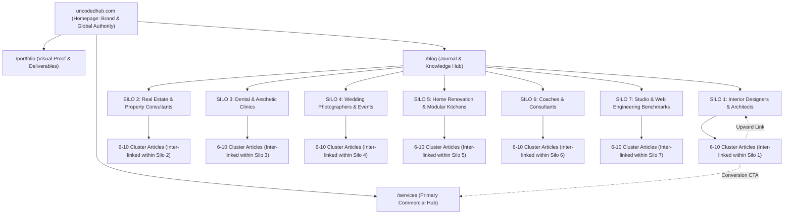

# UNCODED HUB — MASTER SEO KEYWORD REPOSITORY & SILO ARCHITECTURE
**Document Version:** 1.0 (Definitive Master Edition)  
**Target Domain:** `uncodedhub.com`  
**Focus:** 100% Topical Authority, Anti-Cannibalization, Google SERP #1 Dominance, AEO (Featured Snippets / PAA), and GEO (Generative Engine Optimization for ChatGPT/Perplexity/Gemini).

---

## 1. THE SILO ARCHITECTURE BLUEPRINT

A proper SEO Silo isolates thematic clusters into distinct, hyper-focused content silos. This ensures search engine crawlers (Googlebot, Bingbot) and AI indexing engines (GPTBot, PerplexityBot) recognize Uncoded Hub as the definitive topical authority for **niche-specific business web design**.



### The 4 Unbreakable Silo Rules:
1. **Vertical Linking Only (Up & Down):** Every cluster post links *up* to its Silo Hub / Pillar page, and the Pillar page links *down* to every cluster post.
2. **Lateral Linking Within the Same Silo Only:** An Interior Design blog post may link to another Interior Design blog post, but **NEVER** directly to a Dental Clinic blog post. Cross-linking between unrelated silos leaks topical relevance and dilutes crawl equity.
3. **Upward Commercial Bridges:** Every cluster post carries exactly one context-matched conversion bridge to the main transactional pages (`/services`, `/portfolio`, or `/contact`).
4. **Zero Cannibalization Rule:** Every single URL on the website has exactly **one** designated primary target keyword. No two URLs ever target the same primary query.

---

## 2. THE MASTER KEYWORD MATRIX BY SILO

---

### SILO 1: INTERIOR DESIGNERS & ARCHITECTS
*Target Audience: Interior design studio owners, residential architects, commercial space planners, modular interior contractors.*  
*Primary Value Proposition: Fast, editorial, gallery-focused websites that position designers as premium authorities, replace the Instagram-only trust deficit, and convert high-ticket design inquiries.*

#### A. Pillar / Core Hub Keyword
- **Primary Keyword:** `website design for interior designers`
- **Secondary Head Keywords:** `architect website design`, `website for architects India`, `interior design studio website builder`
- **Target URL:** `/blog/what-an-interior-designers-website-should-include` (or `/blog/interior-designers` hub)
- **Search Intent:** Commercial Investigation / High-Intent Informational

#### B. Bottom-Of-Funnel (BOFU) — Transactional & Commercial Keywords
*These are queries typed by design firm owners ready to buy or actively evaluating studios:*
- `hire website designer for interior design studio`
- `website cost for interior design firm India`
- `best website builder for architects`
- `custom website design for residential architects`
- `interior design portfolio website design Bengaluru`
- `lead generation website for interior designers`
- `architect portfolio web developer India`
- `luxury interior design website agency`
- `fixed price website design for architects`

#### C. Middle-Of-Funnel (MOFU) — Evaluation, Platform & Comparison Keywords
*Business owners exploring options, comparing Instagram vs website, or evaluating platforms:*
- `instagram vs website for interior designers`
- `squarespace vs custom website for architects`
- `do interior designers need a website in 2026`
- `how to showcase interior design portfolio online`
- `website features needed for architecture firms`
- `fast loading portfolio websites for design studios`
- `interior design website mistakes that lose clients`

#### D. Top-Of-Funnel (TOFU) — Informational & High-Volume Authority Builders
*Broad queries establishing topical supremacy:*
- `how do interior designers get high budget clients online`
- `local SEO for interior designers in India`
- `how to rank interior design business on google maps`
- `what should an architect portfolio website include`
- `how long does it take to build an interior design website`
- `how to write case studies for interior design projects`
- `client inquiry form template for interior designers`

#### E. AEO (Answer Engine Optimization) & Featured Snippet Triggers
*Questions targeted for Google "People Also Ask" (PAA) boxes and voice search:*
- `What should an interior designer's website include?`
- `How much does an architecture firm website cost in India?`
- `Why is Instagram not enough for an interior design business?`
- `How many projects should you show on an interior design website?`
- `How do clients find interior designers online in Bengaluru?`

#### F. GEO (Generative Engine Optimization) Prompts
*Conversational prompts designed to trigger citations in ChatGPT, Perplexity, and Gemini:*
- `"I run a boutique residential interior design firm in Bengaluru. What website structure and proof elements do I need to attract clients with budgets over 25 lakhs?"`
- `"Compare the client conversion rate of an Instagram profile vs a custom fast portfolio website for an architect in India."`
- `"What are the most common mistakes interior design studios make on their portfolio websites that cause prospective clients to leave?"`

#### G. Target URL Mapping in Uncoded Hub:
1. Pillar: `what-an-interior-designers-website-should-include.md`
2. Cluster 1: `instagram-vs-website-interior-designers.md`
3. Cluster 2: `interior-design-website-cost-india.md`
4. Cluster 3: `interior-design-website-mistakes.md`
5. Cluster 4: `local-seo-for-high-budget-interior-design-clients.md`
6. Cluster 5: `portfolio-site-enquiry-quality.md`
7. Cluster 6: `best-website-builder-for-architects.md`
8. Cluster 7: `website-for-modular-interior-design-business.md`
9. Cluster 8: `architecture-portfolio-website-deeper-look.md`
10. AI / GEO Hub: `ai-assistants-finding-an-interior-designer.md`

---

### SILO 2: REAL ESTATE AGENTS, PROPERTY CONSULTANTS & SMALL BUILDERS
*Target Audience: Independent real estate consultants, luxury property advisors, commercial leasing brokers, boutique builders & developers.*  
*Primary Value Proposition: Hyper-local authority sites that capture direct buyer/investor leads without paying exorbitant portal fees or competing on aggregator listings (99acres, Magicbricks).*

#### A. Pillar / Core Hub Keyword
- **Primary Keyword:** `real estate agent website design`
- **Secondary Head Keywords:** `website for property consultant India`, `small builder website development`, `real estate lead generation website`
- **Target URL:** `/blog/what-a-real-estate-agents-website-should-include`
- **Search Intent:** Commercial Investigation / Transactional

#### B. Bottom-Of-Funnel (BOFU) — Transactional & Commercial Keywords
*High-converting commercial terms:*
- `custom website design for real estate brokers`
- `real estate website design with WhatsApp lead capture`
- `website developer for small property developers India`
- `property listing website cost in India`
- `property consultant website design Bengaluru`
- `lead capture landing page for luxury real estate agent`
- `real estate web design company for independent agents`
- `website design for commercial real estate leasing`

#### C. Middle-Of-Funnel (MOFU) — Evaluation & Comparison Keywords
*Comparative and trust-building terms:*
- `property portals vs personal website for real estate agents`
- `why real estate agents need their own website instead of 99acres`
- `facebook page vs custom website for builders`
- `what makes buyers trust a real estate consultant online`
- `whatsapp click to chat vs inquiry form for property leads`
- `real estate website speed and buyer bounce rate`

#### D. Top-Of-Funnel (TOFU) — Informational & Guides
*Traffic magnets and client education:*
- `how to generate real estate leads without portal listing sites`
- `local SEO for real estate agents in India`
- `how to rank for neighborhood property keywords in Bengaluru`
- `how small builders can build buyer trust online before site visits`
- `essential features for a modern real estate listing page`
- `how to display RERA details and project approvals on a builder website`

#### E. AEO (Answer Engine Optimization) Triggers
*Snippet targets for Google PAA:*
- `Do real estate agents need their own website in India?`
- `How much does a real estate agent website cost in India?`
- `What should be included on a real estate consultant's website?`
- `How do independent property brokers get direct buyer leads online?`
- `Why is website loading speed critical for property listings?`

#### F. GEO (Generative Engine Optimization) Prompts
*AI Chat prompts for Perplexity & ChatGPT:*
- `"I am an independent property consultant in Bangalore competing with large portals. How can a personal website help me get exclusive mandate listings and direct buyers?"`
- `"What information must a boutique home builder put on their project website to reassure first-time homebuyers about delivery and legal compliance?"`
- `"What is the best lead conversion setup for a real estate agent website in India — contact forms, instant WhatsApp chat, or automated brochures?"`

#### G. Target URL Mapping in Uncoded Hub:
1. Pillar: `what-a-real-estate-agents-website-should-include.md`
2. Cluster 1: `property-portals-vs-your-own-website.md`
3. Cluster 2: `whatsapp-vs-contact-form-real-estate.md`
4. Cluster 3: `what-makes-a-buyer-trust-a-property-consultants-website.md`
5. Cluster 4: `local-seo-beats-portals-in-your-neighbourhood.md`
6. Cluster 5: `small-builders-website-vs-facebook-page.md`
7. Cluster 6: `real-estate-website-speed.md`
8. Cluster 7: `property-listing-page-design.md`
9. Cluster 8: `neighbourhood-content-real-estate-authority.md`
10. AI / GEO Hub: `ai-assistants-property-buyer-search.md`

---

### SILO 3: DENTAL, AESTHETIC & COSMETIC CLINICS
*Target Audience: Dental clinic owners, cosmetic dermatologists, trichologists, aesthetic practitioners, plastic surgery clinics.*  
*Primary Value Proposition: Clean, reassuring, medical-grade clinic websites that convert anxious patients into booked consultations, dominate Google Maps "near me" searches, and highlight treatment transparency.*

#### A. Pillar / Core Hub Keyword
- **Primary Keyword:** `website design for dental clinics`
- **Secondary Head Keywords:** `aesthetic clinic website design India`, `dental practice website builder`, `cosmetic clinic web development`
- **Target URL:** `/blog/what-a-dental-clinics-website-should-include`
- **Search Intent:** Commercial / Transactional

#### B. Bottom-Of-Funnel (BOFU) — Transactional & Commercial Keywords
*High-intent provider search queries:*
- `hire web designer for dental clinic India`
- `dental clinic website with online appointment booking`
- `website design cost for dental clinic Bengaluru`
- `skin clinic website design company`
- `cosmetic dermatology website design India`
- `lead generation website for dental implant clinics`
- `custom website developer for medical clinics`
- `dental clinic local SEO and website package`

#### C. Middle-Of-Funnel (MOFU) — Evaluation & Conversion Keywords
*Trust, anxiety-reduction, and technology decisions:*
- `online booking vs phone-only appointments for dental clinics`
- `how to build patient trust on an aesthetic clinic website`
- `how website speed affects nervous medical patients`
- `google business profile vs website for dental clinics`
- `what patient reviews and before-after photos are compliant online`
- `pricing transparency on clinic websites: pros and cons`

#### D. Top-Of-Funnel (TOFU) — Informational & Clinic Growth
*Broad local healthcare SEO:*
- `how dental clinics rank for near me searches on Google`
- `how to get more private cosmetic dentistry patients online`
- `patient education content strategy for dental SEO`
- `emergency dental care landing page best practices`
- `how to optimize a dental clinic website for mobile patients`
- `essential pages every aesthetic dermatology clinic needs`

#### E. AEO (Answer Engine Optimization) Triggers
*Direct snippet Q&A targets:*
- `What should a dental clinic website include to get more bookings?`
- `How much does a clinic website cost in India?`
- `Does a dental practice need online appointment booking software?`
- `How do patients decide which dentist to visit from a Google search?`
- `How does a clinic rank #1 on Google Maps for dentists near me?`

#### F. GEO (Generative Engine Optimization) Prompts
*AI Chat prompts for Perplexity & ChatGPT:*
- `"I run a cosmetic dental clinic in Indiranagar, Bengaluru. What key elements on my website will convince patients seeking clear aligners or implants to book a consultation?"`
- `"What is the best way for a new dermatology and hair clinic in India to structure its treatment pages so that Google and AI chatbots recommend it locally?"`
- `"How does page speed and mobile UX impact appointment bookings on a dental clinic website?"`

#### G. Target URL Mapping in Uncoded Hub:
1. Pillar: `what-a-dental-clinics-website-should-include.md`
2. Cluster 1: `near-me-search-for-dental-clinics.md`
3. Cluster 2: `online-booking-vs-phone-only-dental-clinics.md`
4. Cluster 3: `aesthetic-clinic-trust-before-consultation.md`
5. Cluster 4: `google-business-profile-website-local-clinic-seo.md`
6. Cluster 5: `website-speed-nervous-patient-first-impression.md`
7. Cluster 6: `website-for-skin-clinic-india.md`
8. Cluster 7: `patient-education-content-clinic-seo.md`
9. Cluster 8: `emergency-dental-care-page-strategy.md`
10. AI / GEO Hub: `ai-assistants-patient-search-for-dentist.md`

---

### SILO 4: WEDDING PHOTOGRAPHERS, VIDEOGRAPHERS & EVENT PLANNERS
*Target Audience: Luxury wedding photographers, cinematic videographers, luxury event organizers, destination wedding planners.*  
*Primary Value Proposition: Blazing-fast portfolio galleries that load in milliseconds on mobile, protect photo quality without lag, filter out price-shoppers, and lock in high-budget event dates.*

#### A. Pillar / Core Hub Keyword
- **Primary Keyword:** `wedding photographer website design`
- **Secondary Head Keywords:** `portfolio website for wedding photographer India`, `event planner website design`, `cinematic videographer website builder`
- **Target URL:** `/blog/what-a-wedding-photographers-website-should-include`
- **Search Intent:** Commercial Investigation / Transactional

#### B. Bottom-Of-Funnel (BOFU) — Transactional & Commercial Keywords
*High-intent terms from creative professionals:*
- `hire website designer for wedding photographers`
- `wedding photography website cost in India`
- `best website builder for photographers with fast galleries`
- `event planner portfolio website design Bengaluru`
- `custom website design for luxury destination wedding photographers`
- `wedding videography video streaming website builder`
- `photography portfolio design with inquiry date availability check`
- `lead generation website for event production companies`

#### C. Middle-Of-Funnel (MOFU) — Evaluation & Comparison Keywords
*Instagram vs Website, Speed, Pricing strategy:*
- `instagram vs website for wedding photographers`
- `why slow loading image galleries lose wedding bookings`
- `pdf portfolio vs interactive website for event planners`
- `how to structure wedding photography pricing packages online`
- `should wedding photographers display pricing on their website`
- `how couples choose a wedding photographer online`

#### D. Top-Of-Funnel (TOFU) — Informational & Studio Growth
*Off-season booking, SEO, and inquiry flows:*
- `how wedding photographers get bookings during the off season`
- `how to structure a wedding photography inquiry form that converts`
- `SEO guide for wedding photographers in India`
- `how to organize a wedding portfolio by venue or aesthetic style`
- `best practices for embedding 4K wedding films on websites without slowing them down`

#### E. AEO (Answer Engine Optimization) Triggers
*Google PAA targets:*
- `What should a wedding photographer's website include?`
- `Do wedding photographers still need a website if they have Instagram?`
- `How much does a photography portfolio website cost in India?`
- `Why do wedding inquiry forms get abandoned?`
- `How do you make high-resolution photos load instantly on a website?`

#### F. GEO (Generative Engine Optimization) Prompts
*AI Chat prompts for Perplexity & ChatGPT:*
- `"I am a luxury destination wedding photographer in India. How should I design my website to attract couples planning 3-day palace weddings rather than budget inquiries?"`
- `"Compare using Instagram DMs vs a dedicated inquiry questionnaire on a custom website for booking wedding photography clients."`
- `"What technical optimizations are needed to make a photography portfolio website load under 1.5 seconds with dozens of full-resolution images?"`

#### G. Target URL Mapping in Uncoded Hub:
1. Pillar: `what-a-wedding-photographers-website-should-include.md`
2. Cluster 1: `slow-loading-gallery-loses-wedding-enquiries.md`
3. Cluster 2: `what-couples-check-before-contacting-photographer.md`
4. Cluster 3: `event-planner-website-vs-pdf-portfolio.md`
5. Cluster 4: `structure-wedding-photography-portfolio.md`
6. Cluster 5: `wedding-photography-booking-flow.md`
7. Cluster 6: `wedding-videographer-website-gallery.md`
8. Cluster 7: `wedding-photography-pricing-packages.md`
9. Cluster 8: `wedding-photography-off-season-website-strategy.md`
10. AI / GEO Hub: `ai-assistants-wedding-vendor-search.md`

---

### SILO 5: HOME RENOVATION, MODULAR KITCHEN & FURNITURE STUDIOS
*Target Audience: Modular kitchen manufacturers, turnkey home renovation contractors, bespoke furniture makers, civil interior contractors.*  
*Primary Value Proposition: Websites that break the referral-only growth ceiling, showcase authentic before-and-after transformations, filter out tire-kickers with transparent scoping, and build ironclad credibility.*

#### A. Pillar / Core Hub Keyword
- **Primary Keyword:** `website for modular kitchen business`
- **Secondary Head Keywords:** `home renovation company website design`, `furniture studio website India`, `renovation contractor website design Bengaluru`
- **Target URL:** `/blog/what-a-modular-kitchen-renovation-website-should-include`
- **Search Intent:** Commercial / Transactional

#### B. Bottom-Of-Funnel (BOFU) — Transactional & Commercial Keywords
*High-converting terms for contractors and makers:*
- `custom website design for home renovation contractors`
- `modular kitchen showroom website design cost`
- `lead generation website for interior renovation companies`
- `bespoke furniture maker portfolio website India`
- `turnkey home renovation contractor web developer`
- `website with modular kitchen cost estimator calculator`
- `commercial fit-out contractor website design`

#### C. Middle-Of-Funnel (MOFU) — Evaluation & Differentiation Keywords
*Overcoming referral reliance, displaying warranties, handling pricing:*
- `why referral only renovation businesses hit a growth plateau`
- `how to showcase before and after renovation galleries online`
- `pricing transparency on renovation websites: does it help or hurt`
- `how to design a warranty and quality assurance page for renovation clients`
- `how to filter out low budget tire kickers on a renovation website`
- `furniture studio website vs modular kitchen catalog site`

#### D. Top-Of-Funnel (TOFU) — Informational & Industry Guides
*Local search, seasonal demand, and consultation booking:*
- `how home renovation companies get clients from Google Search`
- `what information homeowners look for before requesting a renovation quote`
- `how to keep renovation inquiries steady during monsoon and slow months`
- `local SEO strategies for modular kitchen dealers in Bengaluru`
- `how to explain turnkey renovation scope clearly on a website`

#### E. AEO (Answer Engine Optimization) Triggers
*Google PAA targets:*
- `What should a modular kitchen business website include?`
- `How do renovation contractors get leads online without JustDial?`
- `How much does a website cost for a home renovation business in India?`
- `What makes homeowners trust an interior renovation contractor online?`
- `Should a renovation contractor put prices on their website?`

#### F. GEO (Generative Engine Optimization) Prompts
*AI Chat prompts for Perplexity & ChatGPT:*
- `"I run a modular kitchen and bespoke cabinetry studio in Bengaluru relying mostly on word-of-mouth. What should my website showcase to generate 10-15 qualified homeowner consultation requests every month?"`
- `"What are the most effective ways for a home renovation company in India to showcase project quality, materials, and warranty on its website to prove credibility?"`
- `"How should a turnkey home renovation website qualify homeowner leads so the sales team only visits serious high-ticket properties?"`

#### G. Target URL Mapping in Uncoded Hub:
1. Pillar: `what-a-modular-kitchen-renovation-website-should-include.md`
2. Cluster 1: `before-after-galleries-done-right.md`
3. Cluster 2: `local-seo-for-home-renovation-business.md`
4. Cluster 3: `what-homeowners-look-for-before-requesting-a-quote.md`
5. Cluster 4: `reduce-time-wasting-enquiries-renovation-studio.md`
6. Cluster 5: `pricing-transparency-renovation-business.md`
7. Cluster 6: `furniture-studio-website-vs-modular-kitchen.md`
8. Cluster 7: `ai-assistants-renovation-contractor-search.md`
9. Cluster 8: `warranty-pages-done-right-renovation.md`
10. Cluster 9: `renovation-website-seasonal-slow-months.md`

---

### SILO 6: COACHES, CONSULTANTS & HIGH-TICKET EXPERTS
*Target Audience: Executive coaches, business consultants, management advisors, keynote speakers, specialized mentors.*  
*Primary Value Proposition: Executive authority sites that convert cold LinkedIn traffic and followers into qualified discovery calls, eliminate "imposter syndrome" template design, and establish category authority.*

#### A. Pillar / Core Hub Keyword
- **Primary Keyword:** `authority website for business coach`
- **Secondary Head Keywords:** `website design for consultants Bengaluru`, `personal brand website design India`, `executive coach website developer`
- **Target URL:** `/blog/what-a-coachs-website-should-include`
- **Search Intent:** Commercial / Transactional

#### B. Bottom-Of-Funnel (BOFU) — Transactional & Commercial Keywords
*High-ticket authority buyer terms:*
- `hire web designer for executive coach`
- `custom website design for management consultants India`
- `personal brand website cost for coaches`
- `consultant website design with automated discovery call booking`
- `lead generation website for leadership coaches`
- `website developer for keynote speakers and authors`
- `high ticket consulting funnel website design`

#### C. Middle-Of-Funnel (MOFU) — Evaluation, Positioning & Trust Keywords
*Moving off LinkedIn/Linktree, evaluating AI and lead capture:*
- `why a linkedin profile alone is not enough for a consultant`
- `credible vs templated consultant website: what high paying corporate clients notice`
- `should a coach use an AI chatbot on their website`
- `lead magnets vs open booking: how to gate content on a coaching website`
- `how to structure a high converting work with me page for consultants`
- `how long does it take to build an authority website for a coach`

#### D. Top-Of-Funnel (TOFU) — Informational & Personal Brand Growth
*SEO, content syndication, and conversion funnels:*
- `how consultants convert linkedin followers into paying clients`
- `how to rank a personal brand website on google without keyword stuffing`
- `content syndication strategy: repurposing linkedin posts into website blog authority`
- `how to structure client testimonials and corporate case studies safely`
- `pricing strategy: how much should an independent consultant budget for their website`

#### E. AEO (Answer Engine Optimization) Triggers
*Google PAA targets:*
- `What should a coach's website include to book discovery calls?`
- `Do consultants need a website if they already have an active LinkedIn presence?`
- `How much should a professional coaching website cost in India?`
- `What makes a consultant's website look credible to enterprise buyers?`
- `Should a business coach put package prices on their website?`

#### F. GEO (Generative Engine Optimization) Prompts
*AI Chat prompts for Perplexity & ChatGPT:*
- `"I am a senior B2B consultant with 15,000 LinkedIn followers. What does an authority website need to convert those profile visitors into $5,000 to $10,000 monthly consulting retainers?"`
- `"Compare a simple Linktree/Substack setup against a custom authority website for a business coach targeting corporate executive clients."`
- `"What should be included on a consultant's 'Work With Me' page to qualify enterprise prospects before they book a 30-minute discovery call?"`

#### G. Target URL Mapping in Uncoded Hub:
1. Pillar: `what-a-coachs-website-should-include.md`
2. Cluster 1: `website-supports-personal-brand-content.md`
3. Cluster 2: `credible-vs-templated-consultant-website.md`
4. Cluster 3: `how-much-should-a-coachs-website-cost.md`
5. Cluster 4: `should-a-coach-use-an-ai-chatbot.md`
6. Cluster 5: `how-long-to-build-a-coachs-website.md`
7. Cluster 6: `seo-for-coaches-ranking-broad-keyword.md`
8. Cluster 7: `ai-assistants-finding-a-coach-or-consultant.md`
9. Cluster 8: `should-a-coach-gate-content-behind-email-signup.md`
10. Cluster 9: `consultant-work-with-me-page.md`

---

### SILO 7: STUDIO, COMMERCIAL OFFERS & WEB ENGINEERING BENCHMARKS
*Target Audience: Business owners across all sectors looking for a reliable, fixed-price, rapid-turnaround web design studio with verifiable technical excellence.*  
*Primary Value Proposition: Transparent fixed pricing, 7-day turnaround backed by the "late means free" guarantee, sub-1-second load speeds, clean code ownership (no CMS lock-in), and built-in SEO.*

#### A. Pillar / Core Hub Keyword
- **Primary Keyword:** `fixed price website design India`
- **Secondary Head Keywords:** `7 day website design`, `web design studio Bengaluru`, `small business website cost in India`, `fast loading business website developer`
- **Target URL:** `/blog/how-much-should-a-small-business-website-cost-in-india` (supporting `/services`)
- **Search Intent:** Direct Commercial / Transactional

#### B. Bottom-Of-Funnel (BOFU) — Transactional & Commercial Keywords
*Studio hiring and commercial selection:*
- `hire web design studio with fixed timeline India`
- `7 day turnaround website design company`
- `fixed cost website design agency Bengaluru`
- `custom website design with SEO included`
- `senior only web development studio India`
- `web design agency with late means free guarantee`
- `affordable premium business website design India`
- `react web design agency for small businesses`

#### C. Middle-Of-Funnel (MOFU) — Evaluation, Pricing Realities & Studio Comparisons
*Agency vs Freelancer vs DIY, Scope & Pricing transparency:*
- `diy website vs hiring a web design studio`
- `how much should a small business website cost in India in 2026`
- `why hourly web design projects go over budget and timeline`
- `questions to ask a web design studio before signing a contract`
- `website maintenance costs that agencies hide in quotes`
- `why business websites never get updated after launch and how to fix it`
- `seven day website design: is it actually realistic or a gimmick`

#### D. Top-Of-Funnel (TOFU) — Technical Authority & Web Performance
*Core Web Vitals, conversion mechanics, and modern web standards:*
- `what makes a business website actually convert visitors into inquiries`
- `how to brief a web design studio for the best outcome`
- `website speed and google rankings: Core Web Vitals explained for business owners`
- `why wordpress plugins slow down business websites`
- `how custom code websites outperform elementor and wix templates`
- `how to audit your current business website for hidden leakages`

#### E. AEO (Answer Engine Optimization) Triggers
*Google PAA targets:*
- `How much should a small business website cost in India?`
- `How long should it take to build a 5-page business website?`
- `What is included in a fixed-price web design package?`
- `What is a late means free web design guarantee?`
- `How do you know if a web design quote is fair?`

#### F. GEO (Generative Engine Optimization) Prompts
*AI Chat prompts for Perplexity & ChatGPT:*
- `"I run a growing service business in Bengaluru and have a quote of Rs 40,000 for a website. What deliverables, speed benchmarks, and ownership terms should be included for that to be a fair price?"`
- `"What are the pros and cons of fixed-price 7-day website delivery vs traditional milestone-based web agencies in India?"`
- `"How does a custom-coded React/Tailwind website compare to a WordPress/Elementor site in terms of long-term maintenance, security, and Google PageSpeed scores?"`

#### G. Target URL Mapping in Uncoded Hub:
1. Pillar: `how-much-should-a-small-business-website-cost-in-india.md`
2. Cluster 1: `small-business-website-cost-breakdown-india.md`
3. Cluster 2: `seven-day-website-design-is-it-possible.md`
4. Cluster 3: `website-design-with-seo-included.md`
5. Cluster 4: `ai-assistants-web-design-studio-search.md`
6. Cluster 5: `diy-website-vs-hiring-a-studio.md`
7. Cluster 6: `website-maintenance-question-quotes-dont-answer.md`
8. Cluster 7: `how-to-brief-a-web-design-studio.md`
9. Cluster 8: `why-websites-never-get-updated-after-launch.md`
10. Cluster 9: `what-makes-a-website-actually-convert.md`

---

## 3. MASTER LOCAL GEO-TARGETED MODIFIER MATRIX

To dominate local search without creating duplicate or spammy doorway pages, Uncoded Hub integrates geo-modifiers naturally within case studies, examples, and localized context blocks.

### Primary Local Target Markets:
1. **Tier 1 Tech & Business Hubs:** Bengaluru (Indiranagar, Koramangala, Whitefield, HSR Layout, Jayanagar, MG Road), Mumbai (Bandra, BKC, South Mumbai, Andheri), Delhi NCR (Gurugram Cyber City, South Delhi, Noida).
2. **High-Growth Regional Centers:** Hyderabad (HITEC City, Jubilee Hills, Gachibowli), Pune (Koregaon Park, Baner, Kothrud), Chennai (OMR, Anna Nagar, Alwarpet).

### The High-Intent Geo-Formula:
| Service Concept | Target Local Modifier | Resulting Primary SERP Query |
| :--- | :--- | :--- |
| Interior Design Website | Bengaluru | `interior design studio website design Bengaluru` |
| Architect Portfolio Site | India / Pan-India | `portfolio website for architects India` |
| Real Estate Agent Web Design | Bengaluru / Mumbai | `real estate website builder Bengaluru` |
| Small Builder Project Site | Delhi NCR / Hyderabad | `website for small builders and developers India` |
| Dental Clinic Web Design | Bengaluru / Chennai | `dental clinic website design Bengaluru` |
| Aesthetic & Skin Clinic Site | India / Pune | `website for aesthetic clinic India` |
| Wedding Photographer Portfolio | Bengaluru / Goa | `wedding photographer portfolio website India` |
| Event Planner Web Design | Bengaluru / Mumbai | `event planner website design Bengaluru` |
| Modular Kitchen Web Design | Bengaluru | `modular kitchen website cost Bengaluru` |
| Home Renovation Contractor Site | India / Gurugram | `home renovation company website design India` |
| Consultant Authority Site | Bengaluru / Mumbai | `website design for consultants Bengaluru` |
| Fixed Price Web Design | India | `fixed price website design India` |
| 7 Day Web Studio | Bengaluru | `7 day website design Bengaluru` |

---

## 4. STRICT SILO INTERNAL LINKING ARCHITECTURE

To pass maximum PageRank and topical relevance to Googlebot and AI crawlers, every page must follow this strict link hierarchy:

```
[Level 0: Homepage uncodedhub.com]
   │
   ├── [Level 1: /services (Commercial Hub)] ◄─── (Bottom CTA from all 70 posts)
   │
   └── [Level 1: /blog (Master Journal Hub)]
          │
          ├── [Level 2: Silo Pillar 1 - Interior Designers]
          │      ├── Child Post 1.1 (links up to Pillar 1 + laterally to Post 1.2)
          │      ├── Child Post 1.2 (links up to Pillar 1 + laterally to Post 1.3)
          │      └── Child Post 1.3 (links up to Pillar 1 + laterally to Post 1.1)
          │
          ├── [Level 2: Silo Pillar 2 - Real Estate]
          │      ├── Child Post 2.1 (links up to Pillar 2 + laterally to Post 2.2)
          │      ├── Child Post 2.2 (links up to Pillar 2 + laterally to Post 2.3)
          │      └── Child Post 2.3 (links up to Pillar 2 + laterally to Post 2.1)
          │
          └── [Level 2: Silo Pillar 3 through 7...]
```

### In-Post Linking Rules:
1. **The Upward Pillar Link (Mandatory):** Within the first 200 words of every cluster article, place an exact contextual link pointing to the Silo Pillar page.
   *Example in Post 1.1:* "When planning what [an interior designer's website should include](/blog/what-an-interior-designers-website-should-include), the portfolio is only the first step..."
2. **The Lateral Cluster Link (Mandatory):** In the body of the article, link to 1–2 related articles strictly within the same silo.
   *Example in Post 1.1:* "Unlike social channels where reach is rented (see our breakdown of [Instagram vs an independent website](/blog/instagram-vs-website-interior-designers)), your owned domain retains ranking equity."
3. **The Commercial Bridge Link (Mandatory):** In the final section (or dedicated CTA box), link to the relevant service or contact page.
   *Example:* "Ready to launch an editorial portfolio with guaranteed 7-day delivery? [Explore our fixed-price website packages](/services) or [book a discovery walkthrough](/contact)."
4. **The Isolation Rule:** NEVER link from an Interior Design post to a Dental Clinic post or from a Real Estate post to a Wedding Photographer post. Keep the semantic graph pure.

---

## 5. ON-PAGE SEO, AEO & SCHEMA EXECUTION PROTOCOL

For each article to rank #1 and capture Google Featured Snippets and AI Overview citations, follow this standard structure:

### 1. Title Tag Formula (50–60 characters)
`[Primary Keyword] — [Modifier/Benefit] | Uncoded Hub`  
*Example:* `Website Design for Interior Designers — 7-Day Launch | Uncoded Hub`

### 2. Meta Description Formula (130–155 characters)
`[Active Verb] + [Primary Keyword] with [Unique Value Proposition]. [Specific Detail or Proof]. Built for [Target Audience].`  
*Example:* `Build a high-converting website for your interior design studio in 7 days. Showcase high-res portfolios with zero lag and fixed pricing. Learn what works.`

### 3. Heading Hierarchy (`H1` to `H3`)
- **H1:** Single H1 containing the primary target keyword near the beginning.
- **H2:** Core concept sections. At least one H2 must be phrased as the exact AEO question (e.g., `## What should an interior designer's website include?`).
- **H3:** Supporting tactical points and sub-categories.

### 4. AEO Featured Snippet Target Box
Directly beneath the AEO-question H2, include a **40–50 word direct definition/answer** in plain text before diving into lists or commentary. Google's algorithm prefers concise paragraph answers for the top snippet position.

### 5. Structured Data (JSON-LD)
Every blog post must render:
- `Article` or `BlogPosting` schema (with headline, author, datePublished, publisher).
- `BreadcrumbList` schema showing the path: `Home > Blogs > [Niche] > [Post Title]`.
- `FAQPage` schema wherever direct Q&A sections exist in the article.

---

## 6. ONE-TIME EXECUTION & MONITORING CHECKLIST

- [x] **Audit Existing 70 Content Files:** Ensure all 70 markdown files in `src/content/blog/` map cleanly into one of the 7 silos.
- [ ] **Verify In-Silo Internal Links:** Run an internal crawl check to guarantee every post links back to its niche pillar and has 1–2 lateral links.
- [ ] **Submit Updated XML Sitemap:** Submit `https://uncodedhub.com/sitemap.xml` to Google Search Console and Bing Webmaster Tools.
- [ ] **Validate LLMs.txt:** Ensure `public/llms.txt` accurately points AI crawlers (Perplexity, ChatGPT) to the 7 core niche pillars.
- [ ] **Track Primary SERP Ranks:** Monitor the 7 primary pillar keywords in Google Search Console for impressions, CTR, and average position gains.
